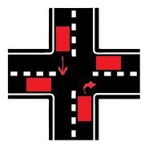
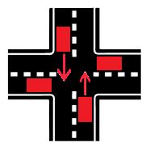

# Intelligent-traffic-lights

## Jak Uruchomić Projekt na Ubuntu
1. **Kompilacja**: Upewnij się, że masz zainstalowany kompilator C (np. gcc), bibliotekę glib oraz pozostałe wymagane narzędzia.

   sudo apt update
   
   sudo apt install build-essential
   
   sudo apt install pkg-config
   
   sudo apt install libglib2.0-dev
   
3. **Uruchomienie programu**: Aby uruchomić program, należy wybrać nazwę pliku wejściowego w zmiennej INPUT i wykonać następujące polecenia:
   
   make
   
   ./program INPUT=input.json OUTPUT=output.json
   
## Opis algorytmu

Algorytm działa z uwzględnieniem 2 rzeczy:
- ilości samochodów po 4 różnych stronach świata
- długości oczekiwania przez różne strony świata

Program idzie po kolei przez polecenia w pliku input.json i działa według algorytmu.

Polecenie "addVehicle":
- dodaje do kolejki south/north/east/west element typu Vehicle, zawierające potrzebne informacje o samochodzie(id,skąd wyrusza,gdzie wyrusza)
      
Polecenie "step" wymusza nam wybór drogi która będzie miała zielone światło, algorytm wyboru drogi krok po kroku:
- Najpierw sprawdzamy ilość samochodów po każdej stronie zapisując w zmiennych "overall_north, overall_south...."
- Potem patrzymy na zmienne zawierająca ilość samochodów które opuściły daną drogę POD RZĄD (czyli jeżeli wybieramy jakąś drogę, dla pozostałych ta zmienna się zeruje), są to zmienne "out_north, ..."
- Znajdujemy 4 ilorazy (out_dir + 1) / (overall_dir + out_dir + 1)
- Wybieramy tą stronę świata która ma ten iloraz najniższy
- Dodatkowym warunkiem jest jeżeli jakaś strona świata nie była wybrana ponad 10 razy, to jest wybierana ona, żeby za duże korki w dwuch stronach nie spowodowały stanie w trzeciej stronie w nieskończoność
- Jak wybraliśmy stronę z której chcemy dać zielone światło, również damy zielone światło tej stronie w której ruch był by bezkolizyjny z naszą wybraną stroną
- bezkolizyjne ruchy są podane poniżej na rysunku

## Testy
0) input.json
   
Test wzięty z polecenia

1) input1.json

Testowanie jak sobie radzi w przypadku dużej ilości samochodów w liniach east-west i north-south.
Algorytm tak jak i powinien przepuszcza po kolei jeden z west-east, a potem dwa south-north i north-south naraz tworząc bezkolizyjny ruch.

2) input2.json
   
Testowanie jak sobie radzi w przypadku dużej ilości samochodów (30) w linii east-west i nie tak dużej ilości (3) w south-north.
Algorytm tak jak i powinien przepuszcza odpowiedni procent samochodów w linii gdzie jest największy korek, a potem daje przejechać samochodowi z mniejszym korkiem

3) inpit3.json
   
Testowanie bezkolizyjnego przejechanie samochodów w różnych przypadkach tzn.
- cztery na raz jadą w prawo
- prawo + prosto
- lewo + prawo

## Potencjalne przeniesienie układu na platformę embedded
Żeby przenieść układ na rzeczywiste urządzenie, użył bym układ stm32 + raspberryPI
- użył bym RaspberryPI z kamerą do realizacji algorytmu YOLO, który wykrywał by samochody i je zliczał po różnych stronach drogi
- Stm32 podłączył bym z RaspberryPI za pomocą interface'u UART i przekazywał bym do mikrokontrollera polecenia po kolei symulując pythonowy skrypt
- Na Stm32 można wykonać podstawową logikę naszego algorytmu zaimplementowanego w C, używając biblioteki HAL i programu Stm32CubeIDE
